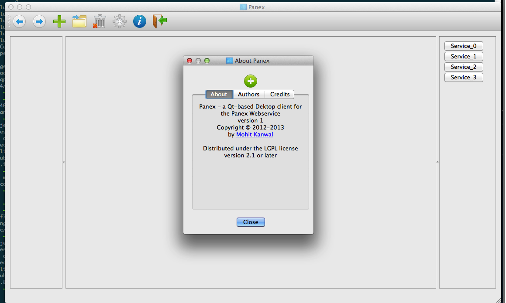

panex-client
============

QT Desktop Client for Panex
  * Checkout source code
  * Run qmake
  * Run executable

###Technical Stuff
-----------------
####Requirements
  * Requires Qt 4.8.4
  * Depends on the Panex API as provided by [panex-web-api][2]

###App Screenshots
------------------

[2]: http://github.com/creativepsyco/panex-web-api
